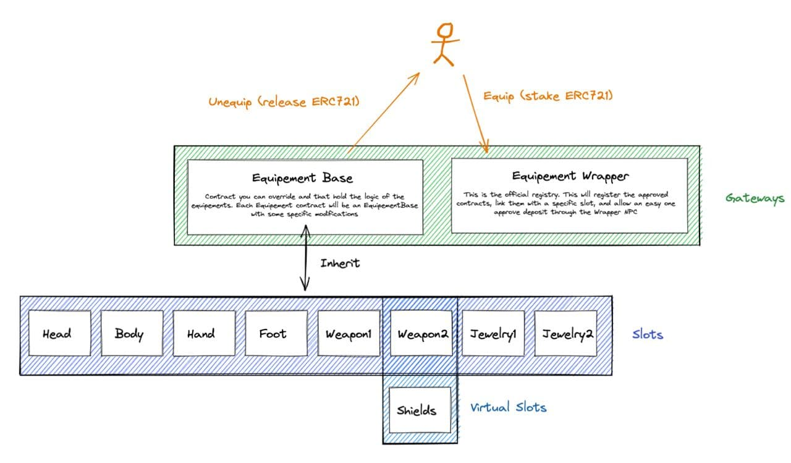

## RarityExtended Equipement

Rarity Equipement is a set of contracts to equip items on your adventurer: shields, weapons, helmets, and more.

Body parts are:
- Head
- Body
- Hand
- Foot
- Primary Weapon
- Secondary Weapon/shield

To equip a specific part you need to call a specific contract for that part. That contract inherits from [rarity_extended_equipement_base.sol](rarity_extended_equipement_base.sol) and handles specific situations for every part. 
Example: you can't have 2 shields equiped.
Parts metadata are not in this contract, every part points to a Codex where it holds everything you need to know about that part. An example is [Basic Set Codex](contracts/extensions/rarity_extended_equipement_basic_set/rarity_extended_basic_set_armor_codex.sol).

Also, you can use [rarity_extended_equipement_wrapper.sol](rarity_extended_equipement_wrapper.sol) to get and set every part from a single contract. Like a proxy aggregator.

You can equip ERC721 and rERC721 items in both.



## Usage

### rarity_extended_equipement_base

Every functions needs to be called on the specific contract:

#### SET functions

To mount a part (ERC721):

```js
function set_equipement(uint _adventurer, address _operator, address _registry, uint256 _tokenID) public;
```

To mount a part (rERC721):

```js
function set_rEquipement(uint _adventurer, uint _operator, address _registry, uint256 _tokenID) public;
```

To mount a part with signature (rERC721)

```js
function set_rEquipement(uint _adventurer, uint _operator, address _registry, uint256 _tokenID, uint256 deadline, bytes calldata signature) public;
```

To unset a part:

```js
function unset_equipement(uint _adventurer) public;
```

#### GET functions

To get equipment:

```js
function getEquipement(uint _adventurer) public view returns (uint, address, address, uint8, uint8, bool);
```

#### ADMIN functions

To add registry:

```js
function addRegistry(address _registry, address _minter, address _codex) public;
```

To remove registry:

```js
function removeRegistry(address _registry) public;
```

To set wrapper:

```js
function setEquipementWrapper(address _wrapper) public;
```

### rarity_extended_equipement_wrapper

Here are same functions as base contract except for `set_rEquipement` with signature.

#### SET functions

To mount a part to specific slot (ERC721):

```js
function set_equipement(uint _slot, uint _adventurer, address _operator, address _registry, uint256 _tokenID) public;
```

To mount a part to specific slot (rERC721):

```js
function set_rEquipement(uint _slot, uint _adventurer, uint _operator, address _registry, uint256 _tokenID) public;
```

#### GET functions

To retrieve equipment by adventurer and slot:

```js
function getEquipementBySlot(uint _adventurer, uint _slot) public view returns (uint tokenID, address registry, address codex, uint8 base_type, uint8 item_type, bool fromAdventurer);
```

To get a slot name:

```js
function getSlotNameByID(uint8 _id) public returns (string memory);
```

#### ADMIN functions

To set register a equipment part contract to a slot:

```js
function registerSlot(address _equipement) public;
```

To clean a slot:

```js
function cleanSlot(uint _slot) public;
```

**[Deployed here](../../../DEPLOYEDCONTRACTS.md#Equipement)**