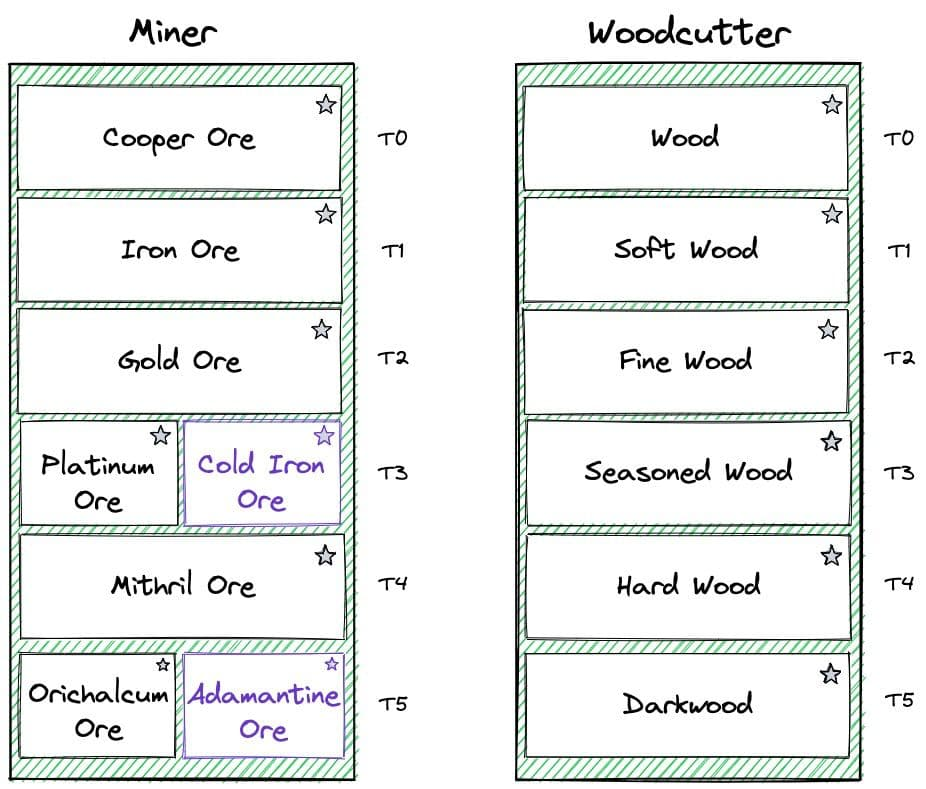
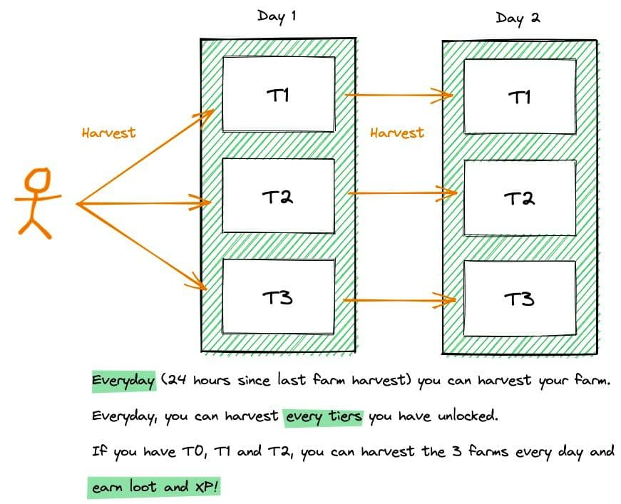
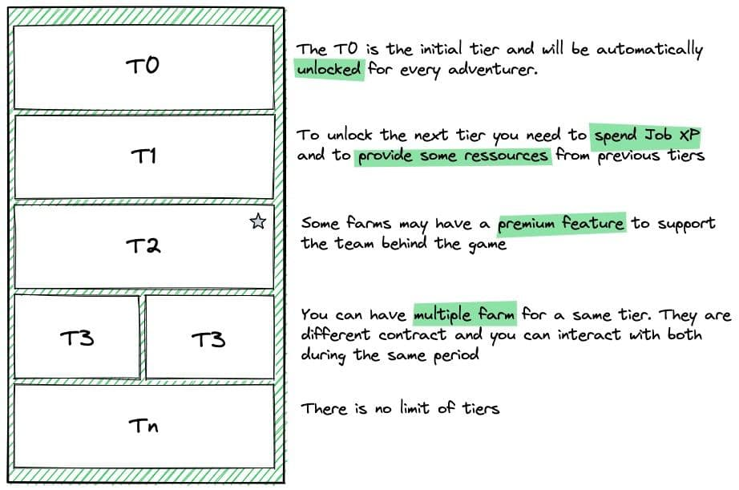
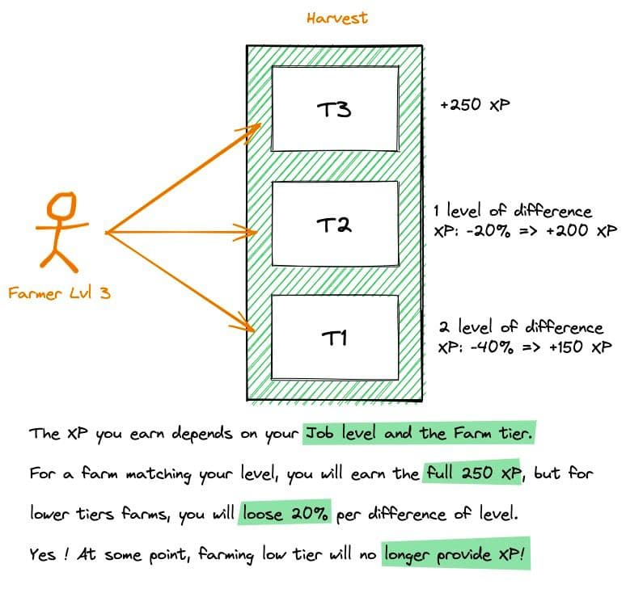

## RarityExtended Farming

A set of contracts to farm materials and gain experience with your adventurer. You can farm wood, minerals and much more.



Composed by 3 contracts [rarity_extended_farming_core.sol](rarity_extended_farming_core.sol), [rarity_extended_farming_base.sol](rarity_extended_farming_base.sol) and [rarity_extended_farming_base_premium.sol](rarity_extended_farming_base_premium.sol).

Farms have tiers, every tier needs a serie of requirements:

- adventurer level.
- tier xp.
- previuos level materials.

You can farm in multiple farms at the same time. But `harvest` triggers a cooldown, and this disable you to harvest again during specific amount of time in the same farm.



**rarity_extended_farming_core** is the contract that manage all required data to farm.
**rarity_extended_farming_base** is the contract that farms inherit. Holds basic behaviors for using everything.
**rarity_extended_farming_base_premium** is a contract to implement aditional payable features. Ideal to fund the team behind development. Example: implement a paid upgrade functions.



To understand how XP works, Major did a cool drawing:



## Usage

### rarity_extended_farming_core

#### SET functions

To earn XP to an adventurer (only a farm can trigger this):

```js
function earnXp(uint _adventurer) external returns (uint);
```

To level up an adventurer:

```js
function levelup(uint _adventurer, uint _farmType) external returns (uint);
```

#### GET functions

To get XP required to level up:

```js
function xpRequired(uint _currentLevel) external pure returns (uint);
```

To get adventurer status:

```js
function adventurerStatus(uint _adventurer, uint _farmType) public view returns (uint, uint);
```

#### ADMIN functions

To register a farm:

```js
function registerFarm(address _farm) public;
```

### rarity_extended_farming_base

#### SET functions

To harvest a farm:

```js
function harvest(uint _adventurer) public;
```

To upgrade the level of a farm:

```js
function upgrade(uint _adventurer) public payable;
```

To unlock a farm (one time):

```js
function unlock(uint _adventurer) public;
```

#### GET functions

To get an estimation of a harvest:

```js
function estimateHarvest(uint _adventurer) public view returns (uint);
```

To get a boolean to know if an adventurer can farm:

```js
function adventurerHasAccess(uint _adventurer) public view returns (bool);
```

### rarity_extended_farming_base_premium

#### GET functions

To get the price for upgrading:

```js
function upgradePrice(uint _toUpgradeLevel) public view returns (uint256);
```

**[Deployed here](../../../DEPLOYEDCONTRACTS.md#Farm)**